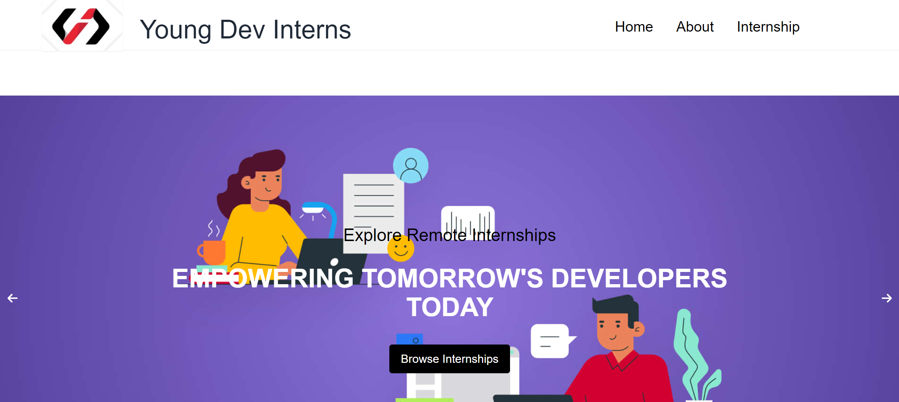

[](https://app.netlify.com/sites/youngdevinterns/deploys)
# YoungDevInterns Clone



## Description

This project is a clone of the YoungDevInterns website, created as part of my on-site internship. The clone replicates the original site using modern web development technologies. 

### Technologies Used
- **React**: JavaScript library for building user interfaces.
- **Vite**: Build tool that provides fast development and builds.
- **Tailwind CSS**: Utility-first CSS framework for styling.
- **React Router**: Declarative routing for React.js.


## Features

- **Responsive Design**: The site is designed to be fully responsive and look great on all devices.
- **Smooth Navigation**: Implemented with React Router for seamless page transitions.
- **Dynamic Components**: Utilizes modern React features for an interactive user experience.

## Setup and Installation

1. **Clone the Repository**
   ```bash
   git clone https://github.com/your-username/your-repository-name.git

2. **Navigate to Project Directory:**

   
      cd your-repository-name
   
3.**Install Dependencies:**

      npm install
   
4.**Run the Development Server**

      npm run dev
